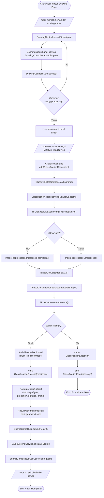
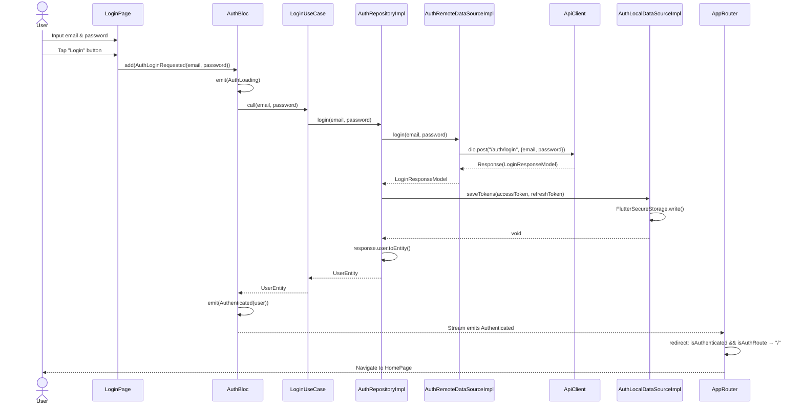
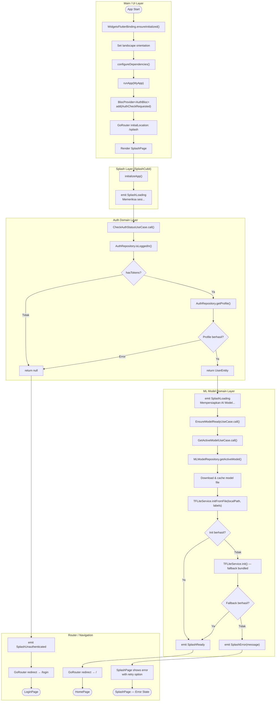

# Dokumentasi Diagram UML — Educational Animal Drawing App

> Analisis codebase Flutter yang menggunakan arsitektur **Clean Architecture** dengan pola **BLoC/Cubit** untuk state management, **GetIt** untuk dependency injection, dan **Dio** untuk networking. Codebase terletak di `lib/` dan terdiri dari modul `core/`, `features/`, `injection/`, `routes/`, dan `shared/`.

---

## 1. Class Diagram

**Sumber file/modul yang dianalisis:**
- `lib/features/auth/` — seluruh layer (domain/data/presentation): entity, repository, use case, datasource, model, dan BLoC.
- `lib/features/classification/` — entity, repository, use case, datasource (TFLite), model, dan BLoC.
- `lib/features/drawing/` — entity (Stroke, Point, Brush), repository, use case, DrawingController, dan DrawingCubit.
- `lib/features/game_session/` — entity, repository, use case, GameScoringService, SubmitGameCubit, HistoryCubit.
- `lib/features/animal/` — entity, repository, use case, dan AnimalBloc.
- `lib/features/ml_model/` — entity, repository, use case (EnsureModelReady, GetActiveModel).
- `lib/features/splash/` — SplashCubit.
- `lib/features/shop/` — entity, enums, repository, use case, dan ShopCubit.
- `lib/features/inventory/` — entity, repository, use case, dan InventoryCubit.
- `lib/features/purchase/` — entity, repository, use case, dan PurchaseCubit.
- `lib/features/leaderboard/` — 3 entity, repository, 3 use case, dan LeaderboardCubit.
- `lib/features/statistics/` — entity, repository, use case, dan StatisticsCubit.
- `lib/core/ml/` — TFLiteService, ImagePreprocessor, TensorConverter.
- `lib/core/network/` — ApiClient, AuthInterceptor, TokenRefreshInterceptor, LoggingInterceptor.
- `lib/core/database/` — AppDatabase, Scores table.

**Asumsi:** Beberapa class yang di-generate (`.g.dart`, `.freezed.dart`) tidak ditampilkan karena merupakan boilerplate. Multiplicitas ditampilkan pada relasi yang jelas dari kode.

```mermaid
classDiagram
    direction TB

    %% ═══════════════════════════════════════
    %% CORE — ML Module
    %% ═══════════════════════════════════════
    class TFLiteService {
        +String modelAssetPath
        +String labelsAssetPath
        +int threads
        -Interpreter? _interpreter
        -bool _isInitialized
        -List~String~ _labels
        +bool isInitialized
        +List~String~ labels
        +List~int~ inputShape
        +List~int~ outputShape
        +init() Future~void~
        +initFromFile(String filePath, List~String~? labels) Future~void~
        +runInference(Object inputTensor, int? outputLength) InferenceOutput
        +resolveInputWidth(int fallback) int
        +resolveInputHeight(int fallback) int
        +resolveInputChannels(int fallback) int
        +resolveOutputClasses(int fallback) int
        +dispose() void
        -_loadLabels(String path) Future~List~String~~
        -_createOutputBuffer(List~int~ shape) Object
        -_flattenOutput(Object output) List~double~
        -_requireInterpreter() Interpreter
    }

    class InferenceOutput {
        +List~double~ scores
        +Duration duration
    }

    class TFLiteServiceException {
        +String message
        +Object? cause
        +toString() String
    }

    class ImagePreprocessor {
        +decodeImage(Uint8List bytes) Image
        +cropToDrawing(Image source) Image
        +centerToSquare(Image source) Image
        +resize(Image source, int width, int height) Image
        +toGrayscaleIfNeeded(Image source, bool enabled) Image
        +replaceBackgroundWithWhite(Image source) Image
        +preprocess(Uint8List imageBytes, int targetWidth, int targetHeight, bool grayscale) Image
        +preprocessFromRgba(Uint8List rgbaBytes, int width, int height, int targetWidth, int targetHeight, bool grayscale) Image
    }

    class ImagePreprocessorException {
        +String message
        +Object? cause
    }

    class TensorConverter {
        +toFloat32(Image image, int channels, double mean, double std) Float32List
        +toInterpreterInput(Float32List data, int width, int height, int channels) Float32List
        +toInterpreterInputForShape(Float32List data, int width, int height, int channels, List~int~ inputShape) Object
        -_normalize(double value, double mean, double std) double
    }

    class TensorConverterException {
        +String message
        +Object? cause
    }

    TFLiteService --> InferenceOutput : returns
    TFLiteService ..> TFLiteServiceException : throws
    ImagePreprocessor ..> ImagePreprocessorException : throws
    TensorConverter ..> TensorConverterException : throws

    %% ═══════════════════════════════════════
    %% CORE — Network Module
    %% ═══════════════════════════════════════
    class ApiClient {
        +Dio dio
    }

    class AuthInterceptor {
        +FlutterSecureStorage secureStorage
        +onRequest(RequestOptions options, RequestInterceptorHandler handler) void
    }

    class TokenRefreshInterceptor {
        +FlutterSecureStorage secureStorage
        +Dio dio
        +Function? onAuthExpired
        -bool _isRefreshing
        +onError(DioException err, ErrorInterceptorHandler handler) void
        -_logout() void
        -_updateHeaders(RequestOptions options, String? authHeader) RequestOptions
    }

    class LoggingInterceptor {
        +onRequest() void
        +onResponse() void
        +onError() void
    }

    ApiClient *-- AuthInterceptor : has
    ApiClient *-- TokenRefreshInterceptor : has
    ApiClient *-- LoggingInterceptor : has

    %% ═══════════════════════════════════════
    %% CORE — Database Module
    %% ═══════════════════════════════════════
    class AppDatabase {
        +int schemaVersion
    }

    class Scores {
        +IntColumn id
        +TextColumn label
        +RealColumn confidence
        +IntColumn timestamp
    }

    AppDatabase *-- Scores : contains

    %% ═══════════════════════════════════════
    %% AUTH FEATURE — Domain
    %% ═══════════════════════════════════════
    class UserEntity {
        +String id
        +String username
        +String email
        +String? displayName
        +String? avatarUrl
        +int totalPoint
        +String role
        +String? equippedAvatarUrl
        +String? equippedFrameUrl
        +String? equippedThemeUrl
        +copyWith() UserEntity
    }

    class AuthRepository {
        <<abstract>>
        +login(String email, String password) Future~UserEntity~
        +register(String username, String email, String password, String? displayName) Future~UserEntity~
        +logout() Future~void~
        +getProfile() Future~UserEntity~
        +refreshToken() Future~void~
        +isLoggedIn() Future~bool~
        +getStoredAccessToken() Future~String?~
    }

    class LoginUseCase {
        -AuthRepository _repository
        +call(String email, String password) Future~UserEntity~
    }

    class RegisterUseCase {
        -AuthRepository _repository
        +call(String username, String email, String password, String? displayName) Future~UserEntity~
    }

    class LogoutUseCase {
        -AuthRepository _repository
        +call() Future~void~
    }

    class CheckAuthStatusUseCase {
        -AuthRepository _repository
        +call() Future~UserEntity?~
    }

    class GetProfileUseCase {
        -AuthRepository _repository
        +call() Future~UserEntity~
    }

    LoginUseCase --> AuthRepository : depends on
    RegisterUseCase --> AuthRepository : depends on
    LogoutUseCase --> AuthRepository : depends on
    CheckAuthStatusUseCase --> AuthRepository : depends on
    GetProfileUseCase --> AuthRepository : depends on
    AuthRepository --> UserEntity : returns

    %% AUTH FEATURE — Data
    class AuthRepositoryImpl {
        -AuthRemoteDataSource _remoteDataSource
        -AuthLocalDataSource _localDataSource
        +login() Future~UserEntity~
        +register() Future~UserEntity~
        +logout() Future~void~
        +getProfile() Future~UserEntity~
        +refreshToken() Future~void~
        +isLoggedIn() Future~bool~
        +getStoredAccessToken() Future~String?~
    }

    class AuthRemoteDataSource {
        <<abstract>>
        +login(String email, String password) Future~LoginResponseModel~
        +register(String username, String email, String password, String? displayName) Future~UserModel~
        +refreshToken(String refreshToken) Future~String~
        +getProfile() Future~UserModel~
        +logout(String refreshToken) Future~void~
    }

    class AuthRemoteDataSourceImpl {
        -ApiClient _apiClient
        +login() Future~LoginResponseModel~
        +register() Future~UserModel~
        +refreshToken() Future~String~
        +getProfile() Future~UserModel~
        +logout() Future~void~
    }

    class AuthLocalDataSource {
        <<abstract>>
        +saveTokens(String accessToken, String refreshToken) Future~void~
        +getAccessToken() Future~String?~
        +getRefreshToken() Future~String?~
        +saveAccessToken(String token) Future~void~
        +clearTokens() Future~void~
        +hasTokens() Future~bool~
    }

    class AuthLocalDataSourceImpl {
        -FlutterSecureStorage _storage
        +saveTokens() Future~void~
        +getAccessToken() Future~String?~
        +getRefreshToken() Future~String?~
        +saveAccessToken() Future~void~
        +clearTokens() Future~void~
        +hasTokens() Future~bool~
    }

    class UserModel {
        +String id
        +String username
        +String email
        +String? displayName
        +String? avatarUrl
        +int totalPoint
        +String role
        +String? equippedAvatarUrl
        +String? equippedFrameUrl
        +String? equippedThemeUrl
        +DateTime createdAt
        +DateTime updatedAt
        +fromJson(Map json)$ UserModel
        +toJson() Map
        +toEntity() UserEntity
    }

    class LoginResponseModel {
        +UserModel user
        +String accessToken
        +String refreshToken
        +fromJson(Map json)$ LoginResponseModel
        +toJson() Map
    }

    class AuthTokensModel {
        +String accessToken
        +String refreshToken
        +fromJson(Map json)$ AuthTokensModel
        +toJson() Map
    }

    AuthRepositoryImpl ..|> AuthRepository : implements
    AuthRemoteDataSourceImpl ..|> AuthRemoteDataSource : implements
    AuthLocalDataSourceImpl ..|> AuthLocalDataSource : implements
    AuthRepositoryImpl --> AuthRemoteDataSource : uses
    AuthRepositoryImpl --> AuthLocalDataSource : uses
    AuthRemoteDataSourceImpl --> ApiClient : uses
    UserModel --> UserEntity : toEntity()
    LoginResponseModel *-- UserModel : contains

    %% AUTH FEATURE — Presentation
    class AuthBloc {
        -CheckAuthStatusUseCase _checkAuthStatusUseCase
        -LoginUseCase _loginUseCase
        -RegisterUseCase _registerUseCase
        -LogoutUseCase _logoutUseCase
        -_onAuthCheckRequested() Future~void~
        -_onAuthLoginRequested() Future~void~
        -_onAuthRegisterRequested() Future~void~
        -_onAuthLogoutRequested() Future~void~
        -_onAuthPointsDeducted() void
        -_onAuthUserEquipmentUpdated() void
    }

    class AuthEvent {
        <<sealed>>
    }
    class AuthCheckRequested
    class AuthLoginRequested {
        +String email
        +String password
    }
    class AuthRegisterRequested {
        +String username
        +String email
        +String password
        +String? displayName
    }
    class AuthLogoutRequested
    class AuthPointsDeducted {
        +int pointsToDeduct
    }
    class AuthUserEquipmentUpdated {
        +String? equippedAvatarUrl
        +String? equippedFrameUrl
        +String? equippedThemeUrl
        +bool updateAvatar
        +bool updateFrame
        +bool updateTheme
    }

    class AuthState {
        <<sealed>>
    }
    class AuthInitial
    class AuthLoading
    class Authenticated {
        +UserEntity user
    }
    class Unauthenticated
    class AuthError {
        +String message
    }

    AuthCheckRequested --|> AuthEvent
    AuthLoginRequested --|> AuthEvent
    AuthRegisterRequested --|> AuthEvent
    AuthLogoutRequested --|> AuthEvent
    AuthPointsDeducted --|> AuthEvent
    AuthUserEquipmentUpdated --|> AuthEvent

    AuthInitial --|> AuthState
    AuthLoading --|> AuthState
    Authenticated --|> AuthState
    Unauthenticated --|> AuthState
    AuthError --|> AuthState

    AuthBloc --> LoginUseCase : uses
    AuthBloc --> RegisterUseCase : uses
    AuthBloc --> LogoutUseCase : uses
    AuthBloc --> CheckAuthStatusUseCase : uses
    Authenticated --> UserEntity : has

    %% ═══════════════════════════════════════
    %% CLASSIFICATION FEATURE
    %% ═══════════════════════════════════════
    class PredictionEntity {
        +String label
        +double confidence
        +List~double~ rawScores
        +Duration inferenceDuration
    }

    class PredictionModel {
        +fromEntity(PredictionEntity entity)$ PredictionModel
        +toEntity() PredictionEntity
    }

    class ClassificationRepository {
        <<abstract>>
        +warmUpModel() Future~void~
        +classifySketch(Uint8List imageBytes) Future~PredictionEntity~
    }

    class ClassificationRepositoryImpl {
        -TFLiteLocalDataSource _localDataSource
        +warmUpModel() Future~void~
        +classifySketch() Future~PredictionEntity~
    }

    class ClassifySketchUseCase {
        -ClassificationRepository _repository
        +call(ClassifySketchParams params) Future~PredictionEntity~
        +warmUpModel() Future~void~
    }

    class ClassifySketchParams {
        +Uint8List imageBytes
        +bool? forceGrayscale
        +bool isRawRgba
        +int? width
        +int? height
    }

    class TFLiteLocalDataSource {
        <<abstract>>
        +warmUpModel() Future~void~
        +classifySketch(Uint8List imageBytes) Future~PredictionModel~
    }

    class TFLiteLocalDataSourceImpl {
        -TFLiteService _tfliteService
        -ImagePreprocessor _preprocessor
        -TensorConverter _tensorConverter
        +warmUpModel() Future~void~
        +classifySketch() Future~PredictionModel~
        -_findBestIndex(List~double~ scores) int
        -_resolveImageChannels(int width, int height) int
    }

    class ClassificationException {
        +String message
        +Object? cause
    }

    PredictionModel --|> PredictionEntity : extends
    ClassificationRepositoryImpl ..|> ClassificationRepository : implements
    TFLiteLocalDataSourceImpl ..|> TFLiteLocalDataSource : implements
    ClassificationRepositoryImpl --> TFLiteLocalDataSource : uses
    ClassifySketchUseCase --> ClassificationRepository : depends on
    ClassifySketchUseCase --> ClassifySketchParams : receives
    ClassificationRepository --> PredictionEntity : returns
    TFLiteLocalDataSourceImpl --> TFLiteService : uses
    TFLiteLocalDataSourceImpl --> ImagePreprocessor : uses
    TFLiteLocalDataSourceImpl --> TensorConverter : uses
    TFLiteLocalDataSourceImpl --> PredictionModel : creates
    TFLiteLocalDataSourceImpl ..> ClassificationException : throws

    class ClassificationBloc {
        -ClassifySketchUseCase _classifySketchUseCase
        -_onWarmUpRequested() Future~void~
        -_onClassificationRequested() Future~void~
        -_onResetRequested() void
    }

    class ClassificationState {
        <<abstract>>
    }
    class ClassificationInitial
    class ClassificationLoading
    class ClassificationReady
    class ClassificationSuccess {
        +PredictionEntity prediction
    }
    class ClassificationError_State {
        +String message
    }

    ClassificationInitial --|> ClassificationState
    ClassificationLoading --|> ClassificationState
    ClassificationReady --|> ClassificationState
    ClassificationSuccess --|> ClassificationState
    ClassificationError_State --|> ClassificationState

    ClassificationBloc --> ClassifySketchUseCase : uses
    ClassificationSuccess --> PredictionEntity : has

    %% ═══════════════════════════════════════
    %% DRAWING FEATURE
    %% ═══════════════════════════════════════
    class Point {
        +double x
        +double y
        +toOffset() Offset
    }

    class Stroke {
        +List~Point~ points
        +int colorValue
        +double strokeWidth
        +bool isEraser
        +copyWith() Stroke
    }

    class Brush {
        +Color color
        +double strokeWidth
        +ToolType tool
        +copyWith() Brush
    }

    class ToolType {
        <<enumeration>>
        pen
        eraser
    }

    class DrawingRepository {
        <<abstract>>
        +saveDrawing(List~Stroke~ strokes, String? id) Future~void~
        +loadDrawing(String? id) Future~List~Stroke~~
        +clearDrawing(String? id) Future~void~
    }

    class SaveDrawingUseCase {
        -DrawingRepository _repository
        +call(List~Stroke~ strokes, String? id) Future~void~
    }

    class LoadDrawingUseCase {
        -DrawingRepository _repository
        +call(String? id) Future~List~Stroke~~
    }

    class ClearDrawingUseCase {
        -DrawingRepository _repository
        +call(String? id) Future~void~
    }

    class DrawingController {
        +ValueNotifier~List~Stroke~~ strokes
        +ValueNotifier~Stroke?~ current
        +Brush brush
        +ValueNotifier~Brush~ brushNotifier
        +Listenable repaint
        +startStroke(Offset pos) void
        +addPoint(Offset pos) void
        +endStroke() void
        +undo() void
        +clear() void
        +setBrush(Brush b) void
        +disposeController() void
    }

    class DrawingCubit {
        +DrawingController controller
        +SaveDrawingUseCase saveUseCase
        +LoadDrawingUseCase loadUseCase
        +ClearDrawingUseCase clearUseCase
        +String? selectedAnimal
        +setSelectedAnimal(String? animal) void
        +save(String? id) Future~void~
        +load(String? id) Future~void~
        +clear(String? id) Future~void~
        +undo() void
        +setBrush(Brush brush) void
    }

    Stroke *-- "1..*" Point : contains
    Brush --> ToolType : has
    DrawingController --> Stroke : manages
    DrawingController --> Brush : manages
    DrawingRepository --> Stroke : persists
    SaveDrawingUseCase --> DrawingRepository : depends on
    LoadDrawingUseCase --> DrawingRepository : depends on
    ClearDrawingUseCase --> DrawingRepository : depends on
    DrawingCubit --> DrawingController : uses
    DrawingCubit --> SaveDrawingUseCase : uses
    DrawingCubit --> LoadDrawingUseCase : uses
    DrawingCubit --> ClearDrawingUseCase : uses

    %% ═══════════════════════════════════════
    %% ANIMAL FEATURE
    %% ═══════════════════════════════════════
    class AnimalEntity {
        +String id
        +String name
        +String? description
        +String? thumbnailUrl
        +String? hintImageUrl
        +String difficulty
        +String? funFact
        +List~String~ drawingTips
        +String? traceImageUrl
        +bool isActive
        +int baseScore
    }

    class AnimalRepository {
        <<abstract>>
        +getAnimals() Future~List~AnimalEntity~~
    }

    class GetAnimalsUseCase {
        -AnimalRepository _repository
        +call() Future~List~AnimalEntity~~
    }

    class AnimalBloc {
        -GetAnimalsUseCase _getAnimalsUseCase
        -_onLoadAnimals() Future~void~
    }

    AnimalRepository --> AnimalEntity : returns
    GetAnimalsUseCase --> AnimalRepository : depends on
    AnimalBloc --> GetAnimalsUseCase : uses

    %% ═══════════════════════════════════════
    %% GAME SESSION FEATURE
    %% ═══════════════════════════════════════
    class GameSessionEntity {
        +String id
        +String predictionLabel
        +double confidenceScore
        +int gameScore
        +double? focusScore
        +int drawingDuration
        +DateTime startedAt
        +DateTime finishedAt
        +String? animalName
        +String? animalThumbnailUrl
        +String? modelName
        +String? modelVersion
        +String? imageUrl
    }

    class GameSessionRepository {
        <<abstract>>
        +submitResult(SubmitGameRequest request) Future~GameSessionEntity~
        +getHistory(int page, int limit) Future~PaginatedResponse~
        +getSessionDetail(String id) Future~GameSessionEntity~
    }

    class SubmitGameRequest {
        +String animalId
        +String modelId
        +String predictionLabel
        +double confidenceScore
        +int gameScore
        +double? focusScore
        +int drawingDuration
        +String startedAt
        +List~int~? fileBytes
        +toJson() Map
    }

    class SubmitGameResultUseCase {
        -GameSessionRepository _repository
        +call(SubmitGameRequest request) Future~GameSessionEntity~
    }

    class GetGameHistoryUseCase {
        -GameSessionRepository _repository
        +call(int page, int limit) Future~PaginatedResponse~
    }

    class GetGameSessionDetailUseCase {
        -GameSessionRepository _repository
        +call(String id) Future~GameSessionEntity~
    }

    class GameScoringService {
        +calculateScore(double confidenceScore, bool isCorrectPrediction, int drawingDuration, int baseScore) int
    }

    class SubmitGameCubit {
        -SubmitGameResultUseCase _submitUseCase
        -GetActiveModelUseCase _getActiveModelUseCase
        -GameScoringService _scoringService
        +submitResult(AnimalEntity animal, String predictionLabel, double confidenceScore, int drawingDuration, DateTime startedAt) Future~void~
    }

    class HistoryCubit {
        -GetGameHistoryUseCase _getHistoryUseCase
        +fetchHistory(bool refresh) Future~void~
    }

    GameSessionRepository --> GameSessionEntity : returns
    GameSessionRepository --> SubmitGameRequest : receives
    SubmitGameResultUseCase --> GameSessionRepository : depends on
    GetGameHistoryUseCase --> GameSessionRepository : depends on
    GetGameSessionDetailUseCase --> GameSessionRepository : depends on
    SubmitGameCubit --> SubmitGameResultUseCase : uses
    SubmitGameCubit --> GameScoringService : uses
    SubmitGameCubit --> GetActiveModelUseCase : uses
    SubmitGameCubit --> AnimalEntity : receives
    GameScoringService --> AnimalEntity : uses baseScore
    HistoryCubit --> GetGameHistoryUseCase : uses
    HistoryCubit --> GameSessionEntity : displays

    %% ═══════════════════════════════════════
    %% ML MODEL FEATURE
    %% ═══════════════════════════════════════
    class MLModelEntity {
        +String id
        +String name
        +String version
        +String fileUrl
        +int inputSize
        +bool isActive
        +List~String~ labels
    }

    class MLModelRepository {
        <<abstract>>
        +getActiveModel() Future~MLModelEntity~
    }

    class GetActiveModelUseCase {
        -MLModelRepository _repository
        +call() Future~MLModelEntity~
    }

    class EnsureModelReadyUseCase {
        -GetActiveModelUseCase _getActiveModelUseCase
        -TFLiteService _tfLiteService
        +call() Future~void~
    }

    MLModelRepository --> MLModelEntity : returns
    GetActiveModelUseCase --> MLModelRepository : depends on
    EnsureModelReadyUseCase --> GetActiveModelUseCase : uses
    EnsureModelReadyUseCase --> TFLiteService : uses

    %% ═══════════════════════════════════════
    %% SPLASH FEATURE
    %% ═══════════════════════════════════════
    class SplashCubit {
        -CheckAuthStatusUseCase _checkAuthStatusUseCase
        -EnsureModelReadyUseCase _ensureModelReadyUseCase
        +initializeApp() Future~void~
    }

    SplashCubit --> CheckAuthStatusUseCase : uses
    SplashCubit --> EnsureModelReadyUseCase : uses

    %% ═══════════════════════════════════════
    %% SHOP FEATURE
    %% ═══════════════════════════════════════
    class ShopItemEntity {
        +String id
        +String name
        +String? description
        +String? imageUrl
        +int price
        +ShopCategory category
        +ShopRarity rarity
        +bool isActive
        +DateTime createdAt
        +DateTime updatedAt
    }

    class ShopCategory {
        <<enumeration>>
        AVATAR
        FRAME
        STICKER
        THEME
    }

    class ShopRarity {
        <<enumeration>>
        COMMON
        RARE
        EPIC
        LEGENDARY
    }

    class ShopRepository {
        <<abstract>>
        +getShopItems(int page, int limit, ShopCategory? category, ShopRarity? rarity) Future~PaginatedResponse~
        +getShopItemDetail(String id) Future~ShopItemEntity~
    }

    class GetShopItemsUseCase {
        -ShopRepository _repository
        +call(int page, int limit, ShopCategory? category, ShopRarity? rarity) Future~PaginatedResponse~
    }

    class ShopCubit {
        -GetShopItemsUseCase _getShopItemsUseCase
        -int _currentPage
        -int _limit
        -bool _isFetching
        +fetchItems(ShopCategory? category, ShopRarity? rarity, bool refresh) Future~void~
        +updateFilters(ShopCategory? category, ShopRarity? rarity) void
    }

    ShopItemEntity --> ShopCategory : has
    ShopItemEntity --> ShopRarity : has
    ShopRepository --> ShopItemEntity : returns
    GetShopItemsUseCase --> ShopRepository : depends on
    ShopCubit --> GetShopItemsUseCase : uses
    ShopCubit --> ShopItemEntity : displays

    %% ═══════════════════════════════════════
    %% PURCHASE FEATURE
    %% ═══════════════════════════════════════
    class PurchaseHistoryEntity {
        +String id
        +String userId
        +String shopItemId
        +int priceAtPurchase
        +DateTime purchasedAt
        +ShopItemEntity? shopItem
    }

    class PurchaseRepository {
        <<abstract>>
        +buyItem(String itemId) Future~PurchaseHistoryEntity~
    }

    class BuyItemUseCase {
        -PurchaseRepository _repository
        +call(String itemId) Future~PurchaseHistoryEntity~
    }

    class PurchaseCubit {
        -BuyItemUseCase _buyItemUseCase
        +buyItem(String itemId) Future~void~
        +reset() void
    }

    PurchaseHistoryEntity o-- ShopItemEntity : references
    PurchaseRepository --> PurchaseHistoryEntity : returns
    BuyItemUseCase --> PurchaseRepository : depends on
    PurchaseCubit --> BuyItemUseCase : uses
    PurchaseCubit --> PurchaseHistoryEntity : displays

    %% ═══════════════════════════════════════
    %% INVENTORY FEATURE
    %% ═══════════════════════════════════════
    class UserInventoryEntity {
        +String id
        +String shopItemId
        +String itemName
        +String? itemImageUrl
        +String category
        +String rarity
        +DateTime acquiredAt
    }

    class InventoryRepository {
        <<abstract>>
        +getMyInventory() Future~List~UserInventoryEntity~~
        +getPurchaseHistory() Future~List~PurchaseHistoryEntity~~
        +equipItem(String itemId, String category) Future~void~
        +unequipItem(String category) Future~void~
    }

    class GetMyInventoryUseCase {
        -InventoryRepository _repository
        +call() Future~List~UserInventoryEntity~~
    }

    class GetPurchaseHistoryUseCase {
        -InventoryRepository _repository
        +call() Future~List~PurchaseHistoryEntity~~
    }

    class EquipItemUseCase {
        -InventoryRepository _repository
        +call(String itemId, String category) Future~void~
    }

    class UnequipItemUseCase {
        -InventoryRepository _repository
        +call(String category) Future~void~
    }

    class InventoryCubit {
        -GetMyInventoryUseCase _getMyInventoryUseCase
        -GetPurchaseHistoryUseCase _getPurchaseHistoryUseCase
        -EquipItemUseCase _equipItemUseCase
        -UnequipItemUseCase _unequipItemUseCase
        +fetchInventory() Future~void~
        +fetchPurchaseHistory() Future~void~
        +equipItem(String itemId, String category) Future~void~
        +unequipItem(String category) Future~void~
    }

    UserInventoryEntity --> ShopItemEntity : references via shopItemId
    InventoryRepository --> UserInventoryEntity : returns
    InventoryRepository --> PurchaseHistoryEntity : returns
    GetMyInventoryUseCase --> InventoryRepository : depends on
    GetPurchaseHistoryUseCase --> InventoryRepository : depends on
    EquipItemUseCase --> InventoryRepository : depends on
    UnequipItemUseCase --> InventoryRepository : depends on
    InventoryCubit --> GetMyInventoryUseCase : uses
    InventoryCubit --> GetPurchaseHistoryUseCase : uses
    InventoryCubit --> EquipItemUseCase : uses
    InventoryCubit --> UnequipItemUseCase : uses

    %% ═══════════════════════════════════════
    %% LEADERBOARD FEATURE
    %% ═══════════════════════════════════════
    class LeaderboardEntryEntity {
        +String userId
        +int totalScore
        +int totalGames
        +String username
        +String displayName
        +String? avatarUrl
    }

    class LeaderboardSnapshotEntity {
        +String period
        +String periodLabel
        +List~LeaderboardEntryEntity~ rankings
    }

    class MyRankEntity {
        +int rank
        +int totalScore
        +int totalGames
    }

    class LeaderboardRepository {
        <<abstract>>
        +getLiveLeaderboard(int limit) Future~List~LeaderboardEntryEntity~~
        +getMyRank() Future~MyRankEntity~
        +getLeaderboardSnapshot(String period, String periodLabel) Future~LeaderboardSnapshotEntity~
    }

    class GetLiveLeaderboardUseCase {
        -LeaderboardRepository _repository
        +call(int limit) Future~List~LeaderboardEntryEntity~~
    }

    class GetMyRankUseCase {
        -LeaderboardRepository _repository
        +call() Future~MyRankEntity~
    }

    class GetLeaderboardSnapshotUseCase {
        -LeaderboardRepository _repository
        +call(String period, String periodLabel) Future~LeaderboardSnapshotEntity~
    }

    class LeaderboardCubit {
        -GetLiveLeaderboardUseCase _getLiveLeaderboardUseCase
        -GetMyRankUseCase _getMyRankUseCase
        -GetLeaderboardSnapshotUseCase _getLeaderboardSnapshotUseCase
        +fetchLiveLeaderboard(int limit) Future~void~
        +fetchSnapshot(String period, String periodLabel) Future~void~
        +fetchMyRank() Future~void~
    }

    LeaderboardSnapshotEntity *-- "0..*" LeaderboardEntryEntity : rankings
    LeaderboardRepository --> LeaderboardEntryEntity : returns
    LeaderboardRepository --> MyRankEntity : returns
    LeaderboardRepository --> LeaderboardSnapshotEntity : returns
    GetLiveLeaderboardUseCase --> LeaderboardRepository : depends on
    GetMyRankUseCase --> LeaderboardRepository : depends on
    GetLeaderboardSnapshotUseCase --> LeaderboardRepository : depends on
    LeaderboardCubit --> GetLiveLeaderboardUseCase : uses
    LeaderboardCubit --> GetMyRankUseCase : uses
    LeaderboardCubit --> GetLeaderboardSnapshotUseCase : uses
    LeaderboardEntryEntity --> UserEntity : references via userId

    %% ═══════════════════════════════════════
    %% STATISTICS FEATURE
    %% ═══════════════════════════════════════
    class UserStatisticEntity {
        +String userId
        +int totalGames
        +int totalScore
        +int highestScore
        +double averageFocus
        +int totalDrawingTime
        +DateTime updatedAt
    }

    class StatisticsRepository {
        <<abstract>>
        +getMyStatistics() Future~UserStatisticEntity~
    }

    class GetMyStatisticsUseCase {
        -StatisticsRepository _repository
        +call() Future~UserStatisticEntity~
    }

    class StatisticsCubit {
        -GetMyStatisticsUseCase _getMyStatisticsUseCase
        +fetchMyStatistics() Future~void~
    }

    StatisticsRepository --> UserStatisticEntity : returns
    GetMyStatisticsUseCase --> StatisticsRepository : depends on
    StatisticsCubit --> GetMyStatisticsUseCase : uses
    UserStatisticEntity --> UserEntity : references via userId
    UserStatisticEntity --> GameSessionEntity : aggregates data from

    %% ═══════════════════════════════════════
    %% ROUTING
    %% ═══════════════════════════════════════
    class AppRouter {
        +GoRouter router$
    }

    AppRouter ..> AuthBloc : reads state
    AppRouter ..> SplashCubit : creates
    AppRouter ..> DrawingCubit : creates
    AppRouter ..> ClassificationBloc : creates
    AppRouter ..> SubmitGameCubit : creates
    AppRouter ..> HistoryCubit : creates
    AppRouter ..> LeaderboardCubit : creates
```

---

## 2. Flowchart — Alur Klasifikasi Gambar (Drawing → Classification → Result)

**Sumber file/modul:**
- `lib/features/drawing/presentation/pages/drawing_page.dart` — halaman utama menggambar.
- `lib/features/drawing/presentation/controllers/drawing_controller.dart` — manajemen stroke.
- `lib/features/classification/presentation/bloc/classification_bloc.dart` — menangani event klasifikasi.
- `lib/features/classification/domain/usecases/classify_sketch_usecase.dart` — use case klasifikasi.
- `lib/features/classification/data/datasources/tflite_local_data_source.dart` — pre-processing + inference.
- `lib/routes/app_router.dart` — navigasi ke result page.

**Asumsi:** Alur dimulai dari user menggambar hewan, lalu menekan tombol "Finish" yang memicu klasifikasi dan navigasi ke halaman Result.



---

## 3. Sequence Diagram — Skenario Login User

**Sumber file/modul:**
- `lib/features/auth/presentation/pages/login_page.dart` — UI login.
- `lib/features/auth/presentation/bloc/auth_bloc.dart` — handler `AuthLoginRequested`.
- `lib/features/auth/domain/usecases/login_usecase.dart` — use case login.
- `lib/features/auth/data/repositories/auth_repository_impl.dart` — implementasi repository.
- `lib/features/auth/data/datasources/auth_remote_data_source.dart` — pemanggilan API.
- `lib/features/auth/data/datasources/auth_local_data_source.dart` — penyimpanan token.
- `lib/routes/app_router.dart` — redirect berdasarkan AuthState.

**Asumsi:** Skenario sukses login. Setelah state berubah ke `Authenticated`, GoRouter redirect ke halaman Home (`/`).



---

## 4. Activity Diagram — Alur Startup Aplikasi (Splash → Auth Check → ML Model → Home/Login)

**Sumber file/modul:**
- `lib/main.dart` — entry point aplikasi.
- `lib/features/splash/presentation/bloc/splash_cubit.dart` — `initializeApp()`.
- `lib/features/auth/domain/usecases/check_auth_status_usecase.dart` — cek token + profile.
- `lib/features/ml_model/domain/usecases/ensure_model_ready_usecase.dart` — download model.
- `lib/routes/app_router.dart` — routing redirect logic.
- `lib/features/auth/presentation/bloc/auth_bloc.dart` — `AuthCheckRequested`.

**Asumsi:** Diagram menggunakan swimlane (subgraph) untuk memisahkan layer: Main/UI, Splash, Auth Domain, dan ML Model Domain.



---

## Catatan Tambahan

> [!NOTE]
> **Observasi konsistensi arsitektur:**
> - Semua fitur utama mengikuti pola Clean Architecture yang konsisten: `domain/` (entities, repositories abstract, usecases) → `data/` (datasources, models, repositories impl) → `presentation/` (bloc/cubit, pages, widgets).
> - Fitur `result/`, `home/`, `mode/`, `choose/` hanya memiliki layer `presentation/` karena bersifat UI-only tanpa business logic tersendiri.
> - Tabel `Scores` di `core/database/tables.dart` tampak sebagai **legacy/tidak digunakan secara aktif** — tidak ada referensi dari feature manapun ke tabel ini. Semua data game session dikirim ke API remote.
> - Widget-widget di `shared/widgets/` — `CustomAppBar`, `EquippedAvatarWidget`, `PlaceholderPage`, `PrimaryButton` — adalah komponen UI reusable yang tidak memiliki business logic.
